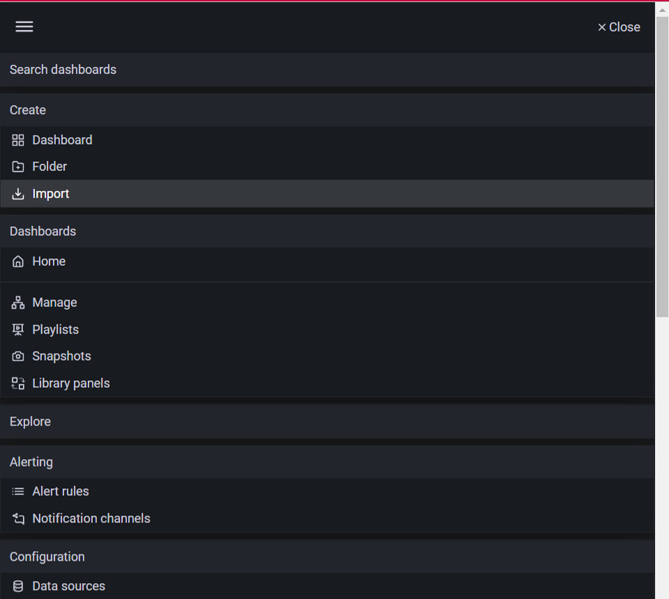
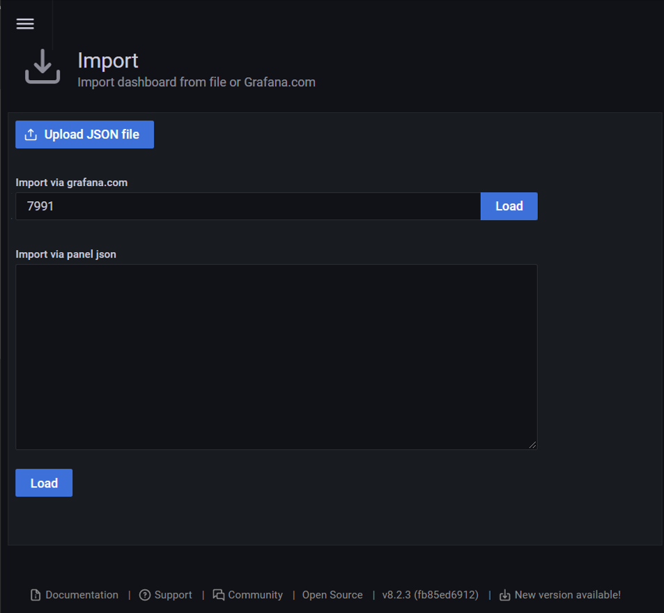
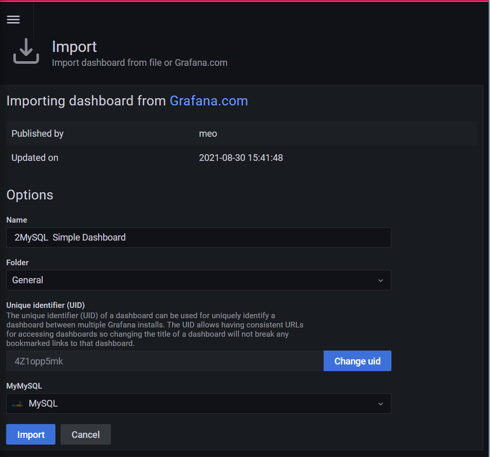
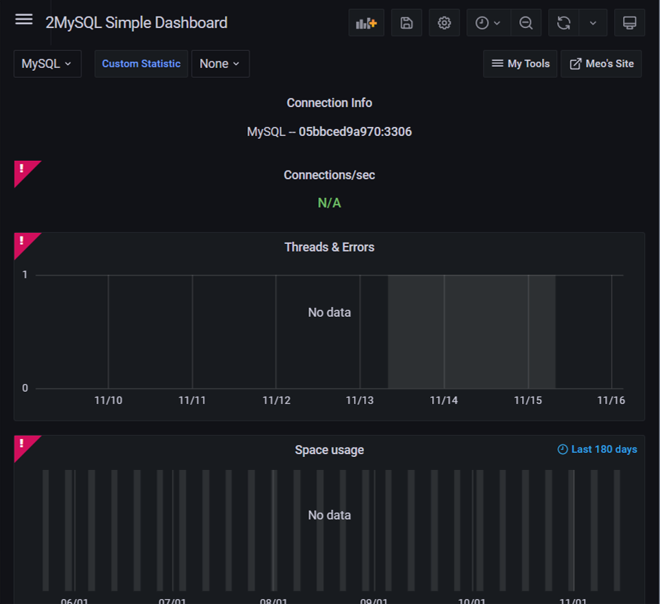

# Step 4: Import MySQL dashboard plugin

Other then create dashboard by ourself, we can also import some dashboard plugin from https://grafana.com/grafana/dashboards/.

In this scenario, we will use `MySQL Overview` as an example.
1. Copy the ID `7991` to cilpboard.

2. Back to Grafana and press the `import` button.

3. Paste the ID just copy in the row `Import via grafana.com` and press `Load`.

4. Select `Import`. It have provided unique ID for the dashboard. Remember to select the datasource

5. The dashboard is set up without data.

